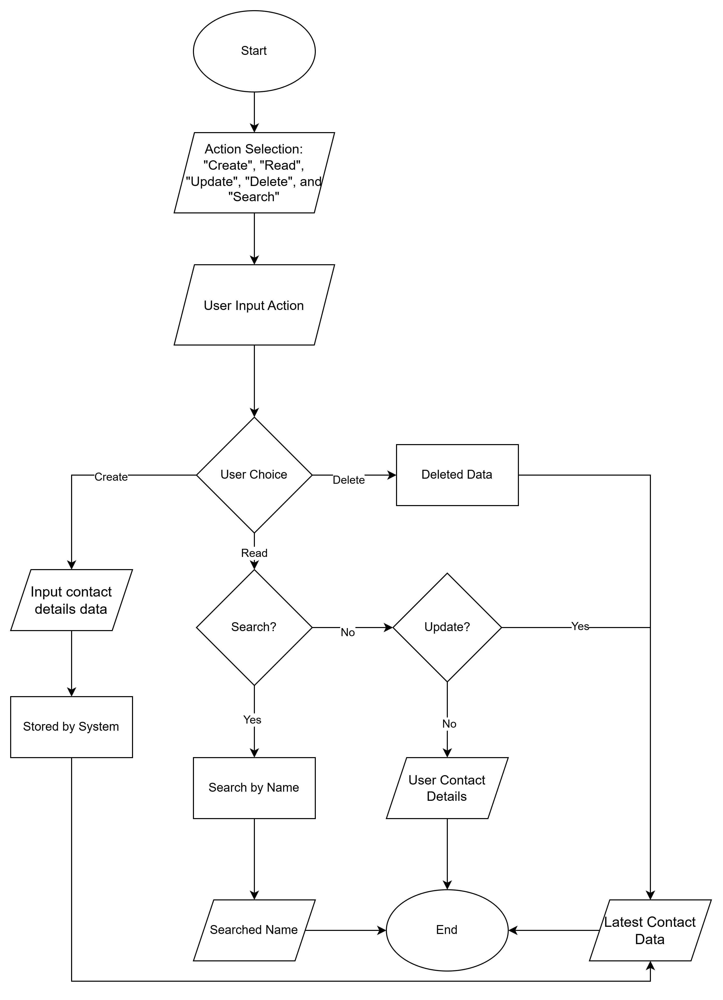

# Address Book Project

A JavaScript-based application that allows users to Create, Read, Update, Delete (CRUD) and search contacts.

## Purpose

This project is inspired by [Google Contacts](https://contacts.google.com/), focusing on the core functionality of storing and managing contact information in a structured way.

The goal of this project is not only to practice building CRUD-based contact management application, but also to improve problem-solving skills by understanding how users interact with contact data .

## Features

- Create new contacts
- Retrieve contact details
- Update existing contacts
- Delete contacts
- Search contacts by keyword

## Flowchart Diagram

## How to Run It
